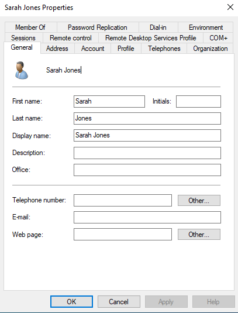

# 👤 User Creation & Management

## 1. Ticket Overview
**Ticket ID:** TICK-001
**Request:** HR Department requested onboarding for a new employee, Sarah Jones.
**Priority:** High

## 2. Objective
Provision a new Active Directory user account with specific organizational placement and security requirements.

## 3. Implementation Steps
### A. Organizational Unit (OU) Structure
* Created a new OU named `HR` to separate Human Resources staff from IT and Sales.
* **Why:** Allows for granular Group Policy application specific to HR.

### B. User Provisioning
* **Tool Used:** Active Directory Users and Computers (ADUC).
* **Account Name:** `sjones`
* **Full Name:** Sarah Jones
* **Department:** HR

### C. Security Configuration
* **Password:** Set temporary initial password.
* **Policy Enforced:** Checked "User must change password at next logon".
* **Reasoning:** Ensures the administrator does not know the user's private password, maintaining non-repudiation security standards.

## 4. Verification
Attempted login on **CLIENT01** as `sjones`. Windows successfully blocked access until the password was changed.

