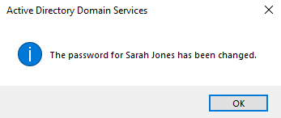

# 🔐 User Password Reset & Account Unlock

## 1. Ticket Overview
**Ticket ID:** TICK-002
**Request:** User 'Sarah Jones' reported being unable to log in after returning from vacation.
**Diagnosis:** Account was locked due to multiple failed login attempts.

## 2. Resolution Steps
### A. Verify Identity
* Confirmed user identity via employee verification protocol (simulated).

### B. Account Action (ADUC)
* **Tool:** Active Directory Users and Computers.
* **Target:** User `sjones` (HR OU).
* **Action:**
    1. Right-clicked user object.
    2. Selected **Reset Password**.
    3. Checked **"Unlock the user's account"** to clear the lockout flag.
    4. Enforced **"User must change password at next logon"** for security.

## 3. Verification
* User successfully logged in with temporary credentials and established a new private password.
* Account status in AD changed from "Locked" to "Active".

