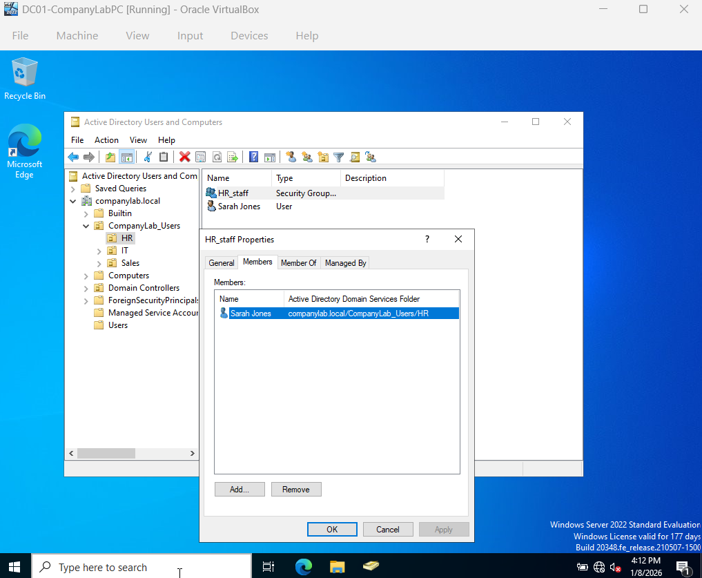

# 👥 Security Group Management (RBAC)

## 1. Ticket Overview
**Ticket ID:** TICK-003
**Request:** Standardize file access permissions for the Human Resources department.
**Goal:** Implement Role-Based Access Control (RBAC) instead of assigning permissions to individual users.

## 2. Implementation
### A. Group Creation
* **Group Name:** `HR_Staff`
* **Type:** Security Group (Global).
* **Location:** `HR` Organizational Unit.

### B. Member Assignment
* **Action:** Added user `sjones` (Sarah Jones) to the `HR_Staff` group.
* **Reasoning:** Future folder permissions will be assigned to this Group. When a new HR employee is hired, we simply add them to this group to inherit all access automatically.

## 3. Verification
* Checked "Members" tab in Group Properties to confirm `sjones` is listed.
* Verified `sjones` effective permissions now include Group membership.

