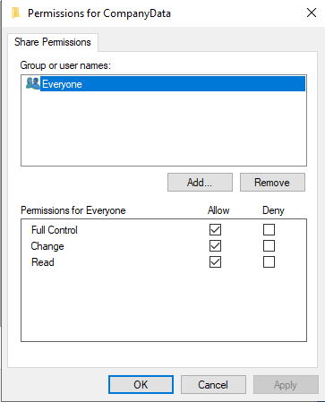
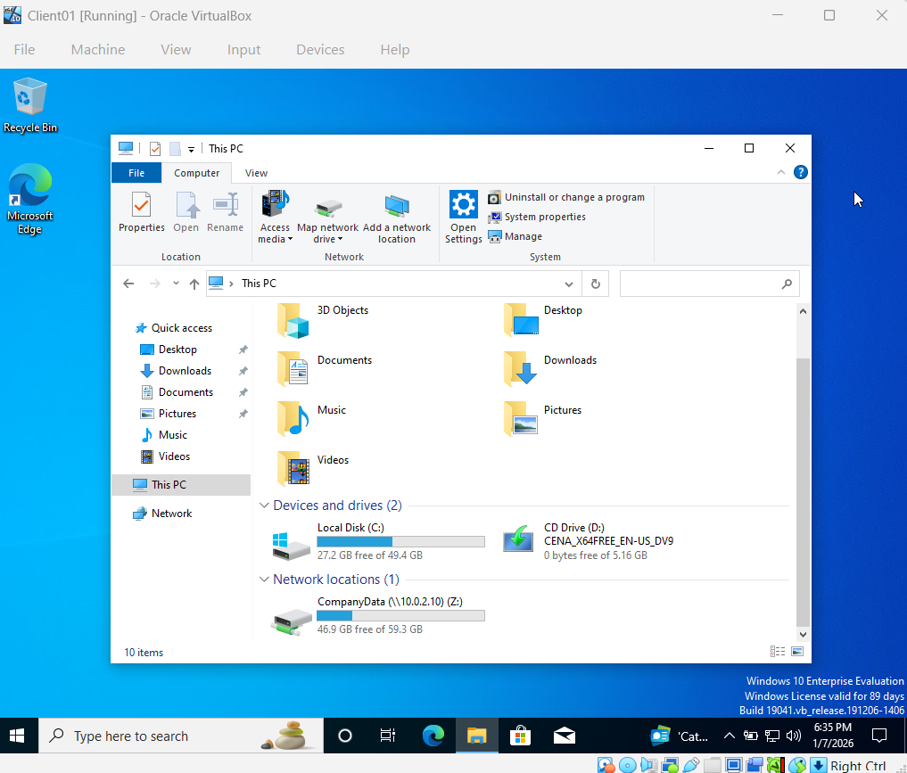

# 📂 File Server & Drive Mapping

## 1. Ticket Overview
**Ticket ID:** TICK-004
**Request:** Create a centralized file storage location for company departments.
**Requirement:** All employees must have the "CompanyData" drive automatically mapped to their workstations.

## 2. Implementation Steps
### A. Server Configuration (DC01)
* **Directory:** Created `C:\CompanyData` root directory.
* **Sharing:** Enabled SMB Sharing with permissions set for Domain Users.
* **UNC Path:** `\\DC01\CompanyData`

### B. Client Mapping (CLIENT01)
* **Action:** Mapped Network Drive manually (simulating Group Policy Preferences).
* **Drive Letter:** Assigned `Z:` drive for consistency.
* **Test:** Verified read/write access by creating a test text file ("test.txt") inside the drive.

## 3. Verification
The network drive is now visible under "This PC" for the user, allowing for centralized data storage.

