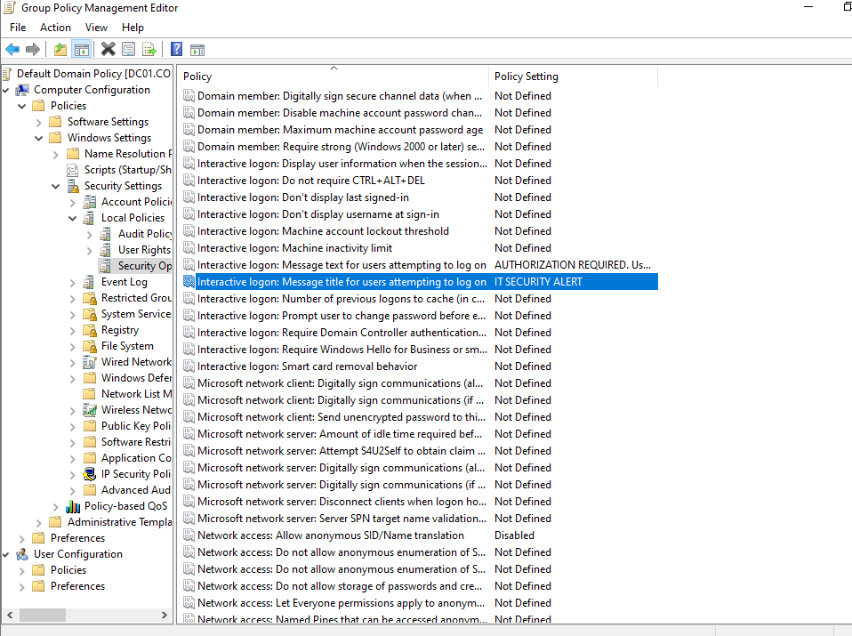

# 🛡️ Group Policy Object (GPO) Management

## 1. Ticket Overview
**Ticket ID:** TICK-005
**Request:** Legal Department requires a mandatory "Authorized Use Only" warning banner on all workstations.
**Objective:** Deploy a GPO to enforce a standardized legal notice at the logon screen for all domain-joined computers.

## 2. Implementation Steps
### A. Policy Configuration (DC01)
* **Tool:** Group Policy Management Console (GPMC).
* **Target:** Default Domain Policy (Applied to all computers).
* **Setting Path:** `Computer Configuration > Windows Settings > Security Settings > Local Policies > Security Options`.
* **Configuration:**
    * **Interactive logon: Message title:** "IT SECURITY ALERT"
    * **Interactive logon: Message text:** "AUTHORIZATION REQUIRED. Usage is monitored..."

### B. Deployment & Testing (CLIENT01)
* **Action:** Forced immediate policy update via Command Prompt.
* **Command:** `gpupdate /force`
* **Verification:** Signed out and verified the Legal Notice popup appeared before the password prompt.
