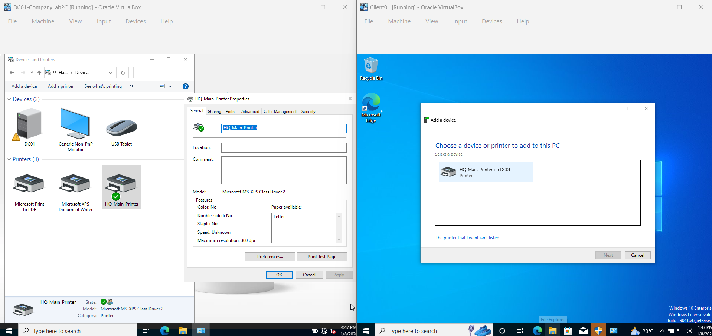

# 🖨️ Enterprise Printer Deployment (AD Integration)

## 1. Ticket Overview
**Ticket ID:** AD-006
**Request:** Deploy new 'HQ-Main-Printer' to the network and ensure it is discoverable by all employees.
**Objective:** Share the print queue from the Server and publish it to the Active Directory database.

## 2. Implementation Steps
### A. Print Server Configuration (DC01)
* **Driver:** Installed Generic / Text Only driver (Simulated hardware).
* **Port:** Assigned to local LPT1.
* **Sharing:** Enabled SMB sharing as `\\DC01\HQ-Main-Printer`.

### B. Directory Publishing
* **Action:** Configured Printer Properties > Sharing.
* **Setting:** Enabled **"List in the directory"**.
* **Result:** The printer object is now registered in the AD Global Catalog, allowing users to search for it by name or location.

## 3. Verification (Client Side)
* **Action:** Initiated "Add Printer" wizard on Windows 10 Client.
* **Method:** Selected "Find a printer in the directory".
* **Outcome:** Successfully located and installed the shared printer from the Domain Controller.

