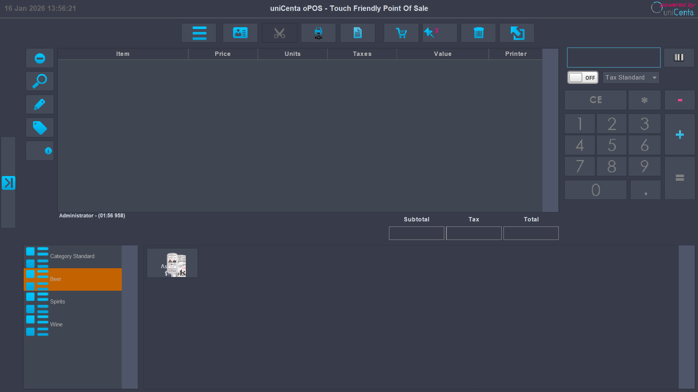
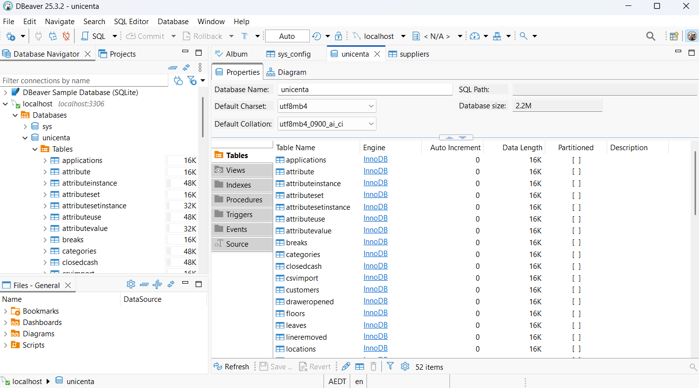

# 🏪 Retail POS Deployment Guide

**Scope:** Standard Operating Procedure (SOP) for deploying Point-of-Sale terminals in a branch environment.
**Software:** uniCenta oPOS v5.0 | **Backend:** MySQL 8.0

> 
---

## 1. Pre-Installation Environment
Before installing the POS software, the operating environment must be hardened.

* **Java Runtime Enforcement:**
    * *Issue:* Modern Windows builds default to Java 22, causing legacy POS crashes.
    * *Fix:* Install **JRE 1.8 (Java 8)**.
    * *Scripting:* Modify `start.bat` to hardcode the path: `set JAVA_HOME=C:\Program Files (x86)\Java\jre1.8.0_xx`.
* **Database Connectivity:**
    * Ensure the terminal has a static IP reservation (e.g., `192.168.1.50`).
    * Verify connectivity to the MySQL Backend Server on Port `3306`.

---

## 2. Software Configuration (uniCenta oPOS)
### Database Connection (Client-Server Architecture)
Instead of using the default embedded database, connect to the corporate SQL server for centralized reporting, data analytics and end-of-day reconciliation.
* **Database:** MySQL
* **Driver:** `com.mysql.jdbc.Driver`
* **URL:** `jdbc:mysql://[SERVER_IP]:3306/unicenta`
* **User/Pass:** `pos_terminal` / `[Encrypted]`

> **Evidence of Configuration:**
> 

---

## 3. Hardware Peripheral Integration
This section details the physical configuration required for standard retail hardware.

### 🖨️ Receipt Printer (Epson TM-T88V / VI)
* **Interface:** USB (Virtual COM Port).
* **Why Virtual COM?** Legacy POS systems send a specific signal (Drawer Kick) to the serial port to open the cash register. USB printing often fails to trigger this.
* **Configuration:**
    1.  Install **Epson Advanced Printer Driver (APD)**.
    2.  Map USB Interface to **COM4** in Device Manager.
    3.  Set POS Config -> Peripherals -> Printer -> **COM4**.
    4.  *Test:* Run a $0.00 transaction to verify the drawer fires.

### 🔫 Barcode Scanner (Zebra DS2208 / Honeywell Orbit)
* **Mode:** HID Keyboard Emulation.
* **Suffix Configuration (CR/Enter):**
    * Scanners must be programmed to send a "Carriage Return" (Enter Key) after every scan.
    * *Action:* Scan the "Add Enter Key" barcode from the Zebra Quick Start Guide.
    * *Result:* Items are instantly added to the cart without the cashier pressing the keyboard.

### 💳 EFTPOS Terminal (Tyro / Linkly)
* **Network:** Dedicated VLAN (Isolated from Guest Wi-Fi).
* **Protocol:** OPI (Open Payment Interface).
* **Disaster Recovery (Standalone Mode):**
    * If the API link goes down, switch POS to "External Payment."
    * Cashier manually types the value into the EFTPOS terminal.
    * Cashier records the **Reference Number** on the POS for reconciliation.

---
