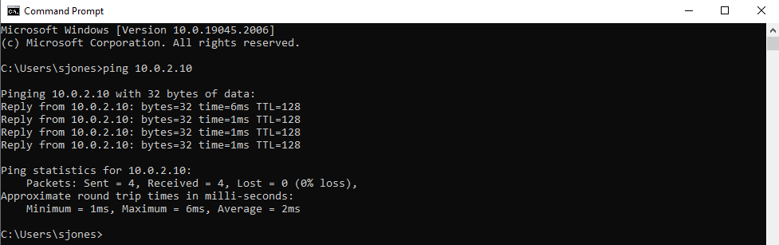
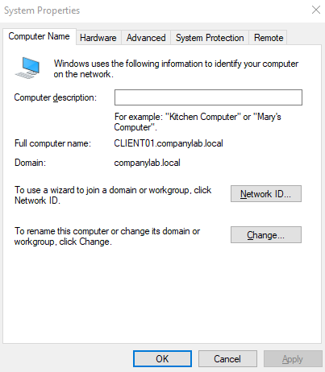

# 🏗️ Lab Environment Setup

## 1. Overview
This document details the infrastructure built to simulate a corporate IT network. The environment consists of a Windows Server 2022 Domain Controller and a Windows 10 Enterprise Client, connected via an isolated internal network.

## 2. Hypervisor Configuration
* **Software:** Oracle VirtualBox 7.0
* **Network Topology:** NAT Network (`NatNetwork`)
* **Subnet:** `10.0.2.0/24`
* **DHCP:** Enabled (Range: `10.0.2.15` - `10.0.2.100`)

## 3. Server Configuration (DC01)
* **OS:** Windows Server 2022
* **Role:** Domain Controller (Active Directory DS, DNS)
* **Hostname:** `DC01`
* **IP Address:** `10.0.2.10` (Static)
* **DNS:** `127.0.0.1` (Loopback)

## 4. Client Configuration (CLIENT01)
* **OS:** Windows 10 Pro
* **Hostname:** `CLIENT01`
* **IP Address:** DHCP (Reserved via NAT Network)
* **DNS Settings:** Pointed to `10.0.2.10` (DC01) to enable domain resolution.

---

## 📸 Verification & Evidence

### A. Network Connectivity Check
Before joining the domain, connectivity was established between the Client and Server using ICMP (Ping).
* **Command:** `ping 10.0.2.10`
* **Result:** 0% Packet Loss, Latency <1ms.

### B. Domain Joining
The Windows 10 Client was successfully joined to the `companylab.local` Active Directory domain.
* **Method:** System Properties > Change Settings > Member of Domain.
* **Credential:** Domain Admin Authentication.

