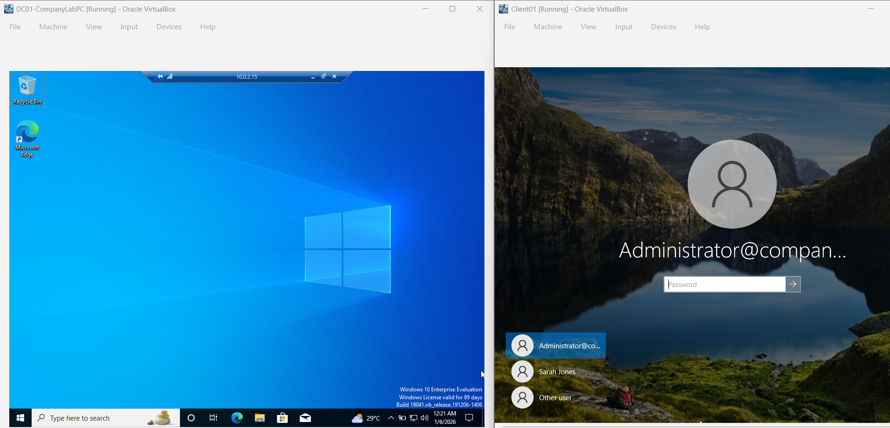

# 🔧 Remote Desktop Protocol (RDP) Configuration

## 1. Ticket Overview
**Ticket ID:** TRB-001
**Request:** IT Management requires remote administration capabilities for all client workstations.
**Issue:** Default Windows security settings block incoming remote connections.

## 2. Objective
Enable Remote Desktop Protocol (RDP) on client endpoints and verify connectivity from the Domain Controller.

## 3. Implementation Steps
### A. Client-Side Configuration (CLIENT01)
* **Action:** Logged in as Local Administrator.
* **Settings:** Navigate to *System > Remote Desktop*.
* **Change:** Toggled "Enable Remote Desktop" to **ON**.
* **Firewall:** Verified Windows Defender Firewall allows "Remote Desktop - User Mode (TCP-In)".

### B. Connection Testing (DC01)
* **Tool:** Microsoft Terminal Services Client (`mstsc.exe`).
* **Target:** `10.0.2.15` (Client IP).
* **Authentication:** Domain Administrator credentials.

## 4. Verification
Successfully established a remote session from the Server to the Client. This allows IT support to resolve issues without physical access to the machine.

