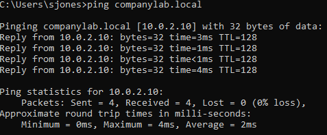

# 🌐 Network Connectivity & DNS Troubleshooting

## 1. Ticket Overview
**Ticket ID:** TRB-005
**Issue:** Workstation `CLIENT01` lost connectivity to the corporate domain `companylab.local`. User reported "Internet works, but I can't access company files."
**Error Message:** `Ping request could not find host companylab.local. Please check the name and try again.`

## 2. Diagnosis & Root Cause Analysis
### A. Initial Connectivity Check
* **Action:** Attempted to ping the Domain Controller IP (`10.0.2.10`).
* **Result:** **Success**. This confirms the physical network link (cable/switch) is functioning.

### B. Name Resolution Test (The Failure)
* **Action:** Attempted to ping the Domain Name (`companylab.local`).
* **Result:** **Failure**.
* **Root Cause:** The Network Adapter was manually configured to use a public DNS (`8.8.8.8`) instead of the internal Domain Controller (`10.0.2.10`). Public DNS servers cannot resolve private local domain names.

## 3. Resolution
### A. IP Configuration Correction
* **Step 1:** Opened Network Adapter IPv4 Properties.
* **Step 2:** Removed invalid DNS entry (`8.8.8.8`).
* **Step 3:** Restored correct Internal DNS IP: `10.0.2.10`.

## 4. Verification
* **Action:** Retested `ping companylab.local`.
* **Result:** Successful reply from `10.0.2.10`. Connection to the domain restored.

