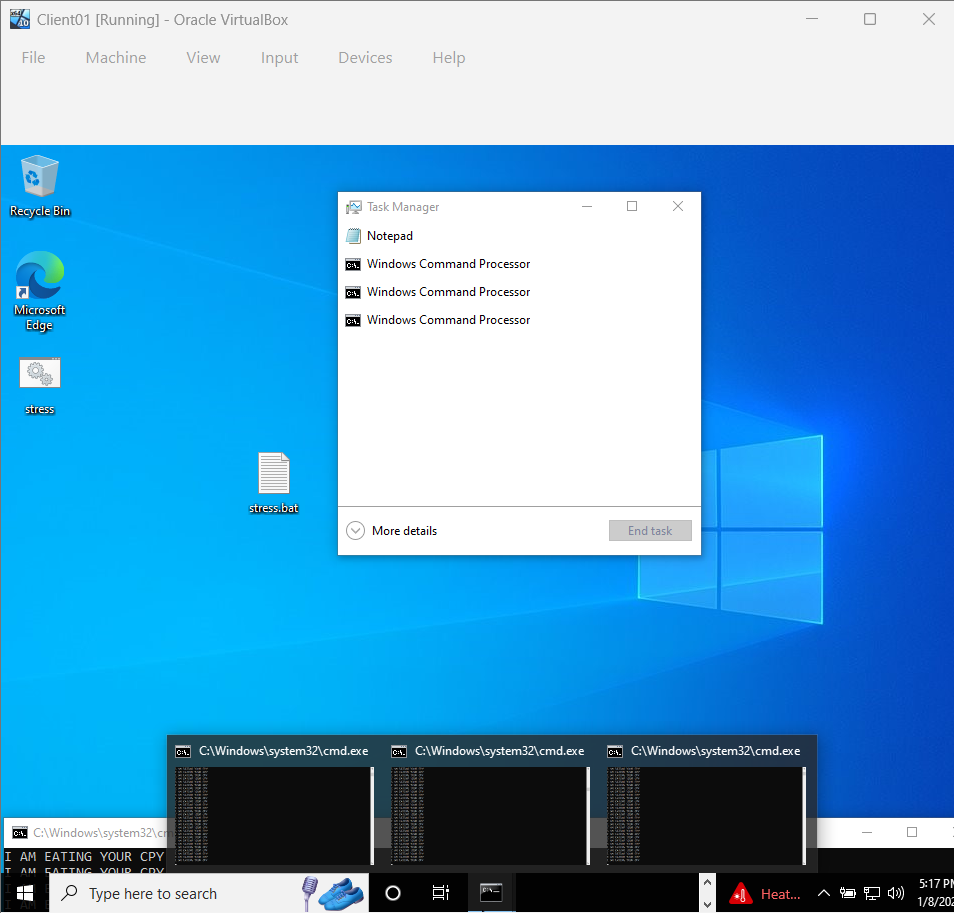

# 🐌 Performance Tuning: High CPU Utilization

## 1. Ticket Overview
**Ticket ID:** TRB-004
**Issue:** User reported workstation was "freezing" and unresponsive to inputs.
**Diagnosis:** System resource monitoring revealed abnormal CPU consumption by a background process.

## 2. Troubleshooting Steps
### A. Analysis
* **Tool:** Windows Task Manager (`Ctrl + Shift + Esc`).
* **Observation:** CPU usage spiked to 100%.
* **Culprit:** Identified multiple instances of `Windows Command Processor` executing a loop script (`stress.bat`).

### B. Remediation
* **Action:** Selected the rogue processes in Task Manager.
* **Command:** Executed "End Task" to force-terminate the application.
* **Verification:** CPU usage dropped immediately to <5%, and system responsiveness was restored.

## 3. Evidence

